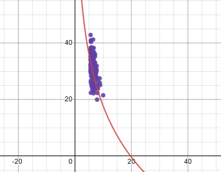

## Logarithmic Regression

##### Plot



------------------------------------------------------------------------

##### Linear model

```haskell
import Data.List
```

```haskell
data Model = Model
  { b0 :: Double
  , b1 :: Double
  } deriving Show
  
linear :: [Double] -> [Double] -> Model
linear x y = Model b0 b1
  where
    b0 = ( _Ey - b1*_Ex ) / n
    b1 = ( n*_Exy - _Ex*_Ey ) / ( n*_Ex2 - _Ex^2 )
    
    n = fromIntegral $ length x :: Double
    _Exy = sum $ zipWith (*) x y
    _Ex = sum x
    _Ey = sum y
    _Ex2 = sum $ zipWith (*) x x
```

------------------------------------------------------------------------

##### Csv library

```sh
:!cabal update && cabal install --lib csv
```
```
> Config file path source is default config file.
> Config file not found: /home/jovyan/.cabal/config
> Writing default configuration to /home/jovyan/.cabal/config
> Downloading the latest package list from hackage.haskell.org
> Package list of hackage.haskell.org has been updated.
> The index-state is set to 2022-12-27T23:47:44Z.
> Resolving dependencies...
> Build profile: -w ghc-8.10.7 -O1
> In order, the following will be built (use -v for more details):
>  - csv-0.1.2 (lib:csv) (requires download & build)
> Downloading  csv-0.1.2
> Downloaded   csv-0.1.2
> Starting     csv-0.1.2 (all, legacy fallback)
> Building     csv-0.1.2 (all, legacy fallback)
> Installing   csv-0.1.2 (all, legacy fallback)
> Completed    csv-0.1.2 (all, legacy fallback)
```

------------------------------------------------------------------------

##### Read x and y

```haskell
import Text.CSV
```

```haskell
Right df <- parseCSVFromFile "EconomiesOfScale.csv"
```

```haskell
x = init $ map read (drop 1 $ head $ filter (\x -> head x == "Number of Units") $ transpose df) :: [Double]
y = map read (drop 1 $ head $ filter (\y -> head y == "Manufacturing Cost") $ transpose df) :: [Double]

print (length x, length y)
```

```
> (1000,1000)
```

------------------------------------------------------------------------

##### Fit Logarithmic Regression

```haskell
model = linear ( map log x ) y
model
```

```
> Model {b0 = 77.87110516608855, b1 = -26.122787920708554}
```

```haskell
predict x = b0 model + (b1 model * log x)
```

------------------------------------------------------------------------

##### Predict and actual value

```haskell
print ("Predict", "Actual")
mapM_ print ( take 20 $ zip ( map predict x ) y )
```

```
> ("Predict","Actual")
> (77.87110516608855,95.06605578)
> (73.41505530121873,96.53174997)
> (73.29408248455584,73.66131056)
> (73.00469524297493,95.5668425)
> (71.04209022342832,98.77701266)
> (70.86844182660386,100.0)
> (70.23773721878221,94.75975637)
> (69.47549669085971,67.18538349)
> (68.71097899821994,72.88604061)
> (67.73690677928502,61.96769605)
> (66.57650881198268,69.28409692)
> (66.01132858375091,64.55249643)
> (65.26379425686136,77.67937742)
> (65.07604459057586,58.42664546)
> (64.74695192821245,51.4409698)
> (64.07421850979719,60.92903611)
> (63.944938041752394,81.86775617)
> (63.41407419714263,60.5725967)
> (63.10136153204646,74.12260141)
> (62.999813275944526,71.61417311)
```

```haskell
rSquare :: [Double] -> [Double] -> Double
rSquare y yhat =
  1 - ( ssr / sst )
  where
    ssr = sum [ ( y - yhat ) **2 | (y, yhat) <- zip y yhat]
    sst = sum [ ( y - mean ) **2 | y <- y]
    
    mean = sum y / fromIntegral (length y)
```

```haskell
rSquare y (map predict x)
```

```
> 0.6722501197259747
```
